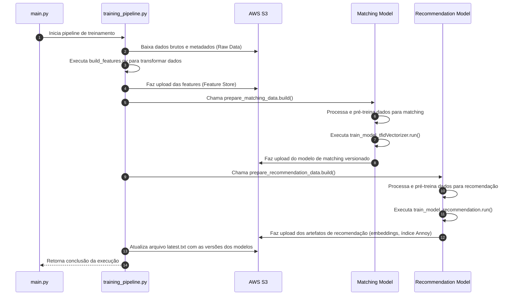

# ML Lab Datathon

Projeto de pipeline de Machine Learning para matching e recomendação de vagas e candidatos, implementado na AWS. O projeto integra processos de ingestão, engenharia de features, treinamento de modelos, detecção de data drift e versionamento de artefatos utilizando S3, Docker e CodeDeploy.

---

## Tabela de Conteúdos

- [Visão Geral](#visão-geral)
- [Estrutura de Pastas](#estrutura-de-pastas)
- [Descrição dos Componentes](#descrição-dos-componentes)
  - [Deployment e Infraestrutura](#deployment-e-infraestrutura)
  - [Ingestão e Armazenamento de Dados](#ingestão-e-armazenamento-de-dados)
  - [Engenharia de Features](#engenharia-de-features)
  - [Modelos de Matching e Recomendação](#modelos-de-matching-e-recomendação)
  - [Detecção de Data Drift](#detecção-de-data-drift)
  - [Pipelines e Orquestração](#pipelines-e-orquestração)
  - [Utilitários e Integrações com S3](#utilitários-e-integrações-com-s3)
- [Detalhes Conceituais e Modelagem](#detalhes-conceituais-e-modelagem)
  - [Detalhes do Modelo de Matching](#modelos-de-matching)
  - [Detalhes do Modelo de Recomendação](#modelos-de-recomendação)
- [Diagrama de Sequência do Pipeline](#diagrama-de-sequência-do-pipeline)
- [Execução](#execução)

---

## Visão Geral

Este repositório contém um pipeline completo de Machine Learning, cuja finalidade é:
- Executar processos de ingestão de dados e engenharia de features.
- Treinar modelos de matching/classificação para combinar vagas com candidatos.
- Treinar modelos de recomendação para sugerir vagas aos candidatos.
- Monitorar a integridade dos dados com uma robusta detecção de data drift utilizando TF-IDF, KSDrift e PSI.
- Utilizar AWS S3 para armazenamento e versionamento dos artefatos (dados, modelos e features).

A aplicação é deployada utilizando AWS Batch, que executa containers Docker para garantir um ambiente isolado e consistente. O workflow de treinamento é disparado diariamente por meio de um pipeline orquestrado com AWS Lambda e Step Functions, promovendo uma execução recorrente e automatizada. Dessa forma, os modelos são continuamente atualizados com os dados mais recentes, garantindo alta disponibilidade e confiabilidade no processo de treinamento e inferência.

---

## Estrutura de Pastas

Abaixo segue a visão completa da estrutura de pastas do projeto:
```plaintext
├── appspec.yml                         # Configuração do CodeDeploy para deployment na AWS ECS
├── Dockerfile                          # Arquivo para construção da imagem Docker
├── main.py                             # Arquivo principal que orquestra a execução dos processos: build de features, treinamento dos modelos e detecção de data drift
├── requirements.txt                    # Dependências do projeto
├── README.md                           # Documentação do projeto (este arquivo)
├── data/                               # Módulo de ingestão, upload e download de dados via S3 
│ ├── downloader.py                     # Baixa dados do S3, gerencia cache local e metadados (JSON e Parquet)      
│ ├── uploader.py                       # Faz o upload de arquivos (features, modelos) para o S3 e atualiza versionamento
├── features/
│ ├── build_features.py                 # Realiza a engenharia de features nos dados brutos
├── models/
│ ├── drift_detector.py                 # Implementa a detecção de data drift usando TF-IDF (com stopwords em Português e Inglês), KSDrift, e PSI; gera relatório detalhado em HTML e analisa a composição linguística (pt, en, outros) 
│ ├── Modelo_Matching_Classificacao/    # Pipeline de matching e classificação dos candidatos 
│ │ ├── prepare_matching_data.py        # Pré-processa e prepara os dados para o treinamento do modelo de matching
│ │ └── train_model_tfidVectorizer.py   # Treina o modelo de matching utilizando TF-IDF, combinando stopwords de múltiplas línguas e aplicando técnicas de classificação
│ ├── Modelo_Recomendacao_Vagas/        # Pipeline para recomendação de vagas 
│ │ ├── prepare_recommendation_data.py  # Prepara os dados para a extração de features e construção de recomendações
│ │ └── train_model_recommendation.py   # Treina o modelo de recomendação, utilizando técnicas de similaridade (por exemplo, Annoy para indexação aproximada de vizinhos) 
├── pipelines/
│ ├── training_pipeline.py              # Orquestra o processo de treinamento dos modelos e preparação dos dados para matching e recomendação
├── scripts/
│ ├── before_install.sh                 # Script executado antes da instalação (CodeDeploy)
│ ├── after_install.sh                  # Script executado após a instalação (CodeDeploy)
│ ├── start_application.sh              # Script para iniciar a aplicação (CodeDeploy)
│ └── stop_application.sh               # Script para interromper a aplicação (CodeDeploy)
└── utils/
├── s3_utils.py                         # Contém funções auxiliares para interação com S3 (upload, download, leitura de arquivos JSON e Parquet)  
```

---

## Descrição dos Componentes

### Deployment e Infraestrutura

- **appspec.yml**: Arquivo de configuração do AWS CodeDeploy. Define os hooks que executam scripts (before_install, after_install, stop e start da aplicação) para gerenciar o ciclo de vida do deployment na AWS ECS.  
- **Dockerfile**: Define a imagem Docker baseada no Python 3.10-slim, instala dependências de compilação (gcc, build-essentials), copia os arquivos do projeto para o container e define o comando de entrada (`python main.py`).

### Ingestão e Armazenamento de Dados

- **data/downloader.py**: Lida com a recuperação dos dados do S3. Implementa cache local com verificação de metadados para garantir que os dados baixados estejam atualizados, minimizando chamadas desnecessárias.
- **data/uploader.py**: Responsável pelo upload dos artefatos para o S3, incluindo features, modelos e arquivos binários. Também contém funções para versionamento (como `get_next_model_version`) e atualização de arquivos de controle (ex: `latest.txt`).

### Engenharia de Features

A engenharia de features é a etapa responsável por transformar os dados brutos em informações relevantes que serão utilizadas pelos modelos. Nesta fase, o pipeline executa diversas operações, entre as quais:

- **Extração e Transformação**: 
  O script features/build_features.py consolida dados provenientes de diversas fontes (por exemplo, arquivos JSON e Parquet baixados dos buckets S3) e realiza a limpeza, transformação e agregação necessária. Essa etapa inclui:
  - Conversão de dados brutos em estruturas normalizadas.
  - Aplicação de transformações como preenchimento de valores ausentes e padronização de formatos.
  - Extração de atributos que serão utilizados na criação da feature store, garantindo que as informações estejam adequadamente formatadas para alimentar os modelos de matching e recomendação.

- **Criação da Feature Store**:
  Os dados processados são armazenados tanto localmente quanto enviados para um bucket S3 específico (por exemplo, decision-data-lake-features), que atua como um repositório central de features. Esse armazenamento versionado permite a consistência dos dados entre os diferentes ciclos de treinamento e possibilita o rollback caso necessário.

- **Integração com o Pipeline**:
  A etapa de engenharia de features é integrada ao pipeline geral, garantindo que, antes de qualquer treinamento de modelo, os dados já estejam transformados e atualizados. Isso possibilita uma execução fluida do pipeline de treinamento, com a garantia de que os modelos estão sendo alimentados com dados consistentes e de alta qualidade.


### Modelos de Matching e Recomendação

- **Modelo_Matching_Classificacao**:
  - **prepare_matching_data.py**: Prepara e pré-processa os dados para o modelo de matching, realizando limpeza e formatação necessária.
  - **train_model_tfidVectorizer.py**: Treina o modelo de matching utilizando o TfidfVectorizer com uma abordagem multilíngue (inglês e português). Considera o uso de stopwords de ambas as línguas para melhor performance na extração de informações textuais.
  
- **Modelo_Recomendacao_Vagas**:
  - **prepare_recommendation_data.py**: Organiza e pré-processa os dados necessários para alimentar o modelo de recomendação de vagas.
  - **train_model_recommendation.py**: Realiza o treinamento do modelo de recomendação. Utiliza métodos de similaridade (como Annoy) para gerar recomendações de vagas com base na similaridade entre os embeddings extraídos dos dados.

### Detecção de Data Drift

- **models/drift_detector.py**: Implementa um robusto detector de data drift aplicando:
  - **TF-IDF**: Para transformar os textos e utilizar os mesmos em análises.
  - **KSDrift e PSI**: Para identificar mudanças significativas na distribuição dos dados, tanto em termos globais quanto por term.
  - **Geração de Relatório em HTML**: O relatório detalha os principais termos que sofreram alterações, métricas do drift (KS, PSI) e fornece documentação para interpretação dos resultados.

### Pipelines e Orquestração

- **pipelines/training_pipeline.py**: Centraliza o fluxo de treinamento dos modelos. Chama as funções de preparação (build) e treinamento para os módulos de matching e recomendação, garantindo que as versões dos modelos sejam integradas e persistidas de maneira versionada no S3.
- **main.py**: Ponto de entrada da aplicação. Executa a construção das features, o pipeline de treinamento e, por fim, a detecção de data drift.

### Utilitários e Integrações com S3

- **utils/s3_utils.py**: Fornece funções auxiliares para upload e download de arquivos no S3, garantindo uma integração consistente com os buckets (ex: `decision-data-lake` e `decision-data-lake-features`). Essa camada abstrai a complexidade da comunicação com o AWS S3 e gerencia aspectos de versionamento.

---

## Detalhes Conceituais e Modelagem

## Modelos de Matching

O modelo de matching foi desenvolvido para identificar se um candidato é adequado para uma vaga, com base em características extraídas textual e categorialmente. Para definir essa adequação, foram considerados os seguintes rótulos positivos (MATCH_SITUACOES_POSITIVAS):
- **Aprovado**
- **Contratado pela Decision**
- **Encaminhar Proposta**
- **Proposta Aceita**

Esses rótulos indicam que o candidato teve um desempenho suficientemente bom em etapas anteriores do processo seletivo e, portanto, deve ser classificado como "match" (valor 1). Por outro lado, todos os demais rótulos são considerados negativos (valor 0).

### Parâmetros e Estratégia de Treinamento

#### 1. Pré-processamento

- **TfidfVectorizer**:  
  Cada coluna de texto é convertida em uma matriz TF-IDF. Foram definidos diferentes parâmetros para maximizar a relevância das features extraídas, de acordo com a natureza de cada coluna:
  - `max_features`: Define o número máximo de termos (ex.: 20 para "titulo_profissional" e "conhecimentos_tecnicos"; 50 para "certificacoes", "outras_certificacoes", "area_atuacao" e "competencia_tecnicas_e_comportamentais"; e 100 para "cv_candidato").
  - **Stopwords**: Utiliza uma combinação de stopwords em português (e, se necessário, podem ser integradas stopwords em inglês) para lidar com dados multilíngues e filtrar termos irrelevantes.

- **OneHotEncoder**:  
  As colunas categóricas são transformadas via OneHotEncoding para permitir que o modelo trate cada categoria de forma independente, ignorando valores desconhecidos durante a inferência.

#### 2. Modelo Classificador - XGBClassifier

O classificador utilizado foi o XGBoost, escolhido pela sua robustez e capacidade de lidar com conjuntos de dados desbalanceados. Os principais parâmetros definidos foram:

- **learning_rate (0.1)**:  
  Define o quão rápido o modelo se adapta aos dados. Um valor de 0.1 equilibra a convergência do modelo e o risco de overfitting, permitindo atualizações graduais durante o treinamento.

- **max_depth (7)**:  
  Controla a complexidade das árvores. Com um valor de 7, o modelo possui profundidade suficiente para capturar interações não-lineares sem se tornar excessivamente complexo, o que minimiza o risco de overfitting.

- **n_estimators (300)**:  
  Número total de árvores a serem construídas. O valor 300 foi selecionado com base em experimentos e validações internas, garantindo um desempenho robusto na modelagem sem exagerar no número de estimadores.

- **scale_pos_weight**:  
  Este parâmetro é calculado como a razão entre o número de casos negativos e positivos. Ele corrige o desbalanceamento de classes, ajudando o modelo a evitar viés para a classe majoritária e melhorando a detecção correta dos casos positivos ("match").

- **random_state (42)**:  
  Garante a reprodutibilidade dos resultados, permitindo que os experimentos feitas no modelo sejam replicáveis.

- **n_jobs (-1)**:  
  O modelo utiliza todos os núcleos disponíveis para acelerar o treinamento.

- **eval_metric ("logloss")**:  
  Métrica de avaliação utilizada para monitorar a performance do classificador durante o treinamento, adequada para problemas de classificação binária.

#### 3. Versionamento e Armazenamento

O gerenciamento de versões do modelo de matching é essencial para manter a rastreabilidade, reprodutibilidade e permitir rollbacks em caso de necessidade. A estratégia adotada para versionamento e armazenamento envolve os seguintes processos:

- **Versionamento com S3:**  
  Os modelos treinados são armazenados no bucket AWS S3 na pasta `models/Modelo_Matching_Classificacao/`. Cada novo treinamento gera uma nova versão do modelo.  
  - A função `get_next_model_version` percorre os folders existentes no S3 para calcular a próxima versão (por exemplo, `v1`, `v2`, etc.).  
  - Essa abordagem garante que cada treinamento seja registrado em seu próprio diretório, facilitando a identificação e a comparação entre iterações.

- **Armazenamento dos Artefatos:**  
  O modelo treinado é salvo localmente como um arquivo pickle (ex.: `model_matching_best.pkl`) e, em seguida, é enviado para o S3 utilizando a função `save_model_pickle`.  
  - O arquivo é nomeado de forma que a sua localização reflita a versão gerada (por exemplo, `models/Modelo_Matching_Classificacao/v2/model_matching.pkl`).
  
- **Atualização do Controle de Versão:**  
  Após o upload do modelo, um arquivo de controle (`latest.txt`) é atualizado no S3 com a referência da versão atual.  
  - Esse arquivo contém o caminho do arquivo do modelo atual, garantindo que a aplicação ou serviços consumidores possam identificar e utilizar a versão mais recente.

Essa abordagem garante que o modelo de matching esteja sempre atualizado e que o fluxo de treinamento e deploy seja gerenciado de forma segura e organizada.

#### 4. Estratégia Geral

A abordagem combinou o pré-processamento robusto com a engenharia de features a partir de dados textuais e categóricos. Utilizando técnicas de transformação (TF-IDF para textos e OneHotEncoding para dados categóricos), o pipeline prepara os dados para serem alimentados no XGBClassifier. A escolha dos parâmetros, aliada à ponderação automática via `scale_pos_weight`, permite combater o desbalanceamento e capturar nuances relevantes na decisão de match entre candidatos e vagas.

Esta arquitetura permite um treinamento eficaz e a manutenção de atualizações versionadas do modelo, garantindo que alterações nos dados (capturadas, por exemplo, via detecção de data drift) possam ser rapidamente identificadas e ajustadas no ciclo de desenvolvimento.

---

## Modelos de Recomendação

O modelo de recomendação foi projetado para identificar e sugerir vagas compatíveis com o perfil dos candidatos, utilizando técnicas de similaridade baseadas em embeddings. A arquitetura do pipeline inclui três etapas principais:

#### 1. Geração de Embeddings

- **Embedding Multilíngue:**  
  Utiliza o modelo `SentenceTransformer` com o checkpoint `paraphrase-multilingual-MiniLM-L12-v2`, capaz de gerar representações semânticas de textos em diversos idiomas.  
  - Os textos dos candidatos e das vagas são convertidos em embeddings vetoriais.  
  - Essa abordagem garante que as similaridades entre textos em línguas diferentes sejam capturadas de forma robusta.

#### 2. Indexação e Busca de Similaridade

- **Annoy Index:**  
  Após a geração dos embeddings, o pipeline constrói um índice usando a biblioteca Annoy.  
  - O índice é criado com base na métrica "angular", ideal para cálculos de similaridade em alta dimensão.  
  - Esse processo permite a recuperação rápida dos vizinhos mais próximos, otimizando a recomendação durante a inferência.
  - A construção do índice é realizada iterativamente, adicionando cada embedding das vagas e, em seguida, efetuando a construção (build) com número definido de árvores para balancear velocidade e precisão.

#### 3. Versionamento e Armazenamento

O gerenciamento de versões dos artefatos do modelo de recomendação é essencial para garantir reprodutibilidade, rastreabilidade e um processo seguro de rollback, quando necessário. Nesta etapa, todo o ciclo de treinamento e deploy é sistematizado da seguinte forma:

- **Armazenamento dos Artefatos de Recomendação:**  
  Após a geração dos embeddings e a construção do índice Annoy, os artefatos (tais como:
  - O arquivo com os embeddings dos candidatos e das vagas.
  - O índice Annoy gerado para a recuperação dos vizinhos próximos.
  - Outras saídas intermediárias úteis para auditoria e diagnóstico)  
  são salvos localmente e, em seguida, enviados para o bucket AWS S3. Cada artefato é armazenado em um diretório que reflete a versão do modelo, por exemplo:  
  `models/Modelo_Recomendacao_Vagas/v2/` ou `models/Modelo_Recomendacao_Vagas/v3/`.

- **Estratégia de Versionamento com S3:**  
  Semelhante ao modelo de matching, a definição da nova versão é automatizada por meio de uma função que verifica os diretórios existentes no S3 e calcula a versão seguinte (ex.: `v1`, `v2`, etc.).  
  Essa prática assegura que cada execução do pipeline de recomendação seja registrada de forma única, facilitando tanto a identificação das mudanças quanto a comparação entre diferentes versões.

- **Controle de Versão Centralizado:**  
  Após o upload dos artefatos referentes ao modelo de recomendação, um arquivo de controle, geralmente denominado `latest.txt`, é atualizado no S3. Esse arquivo contém o caminho completo para os artefatos da versão mais recente, garantindo que a aplicação ou os processos de inferência possam sempre referenciar a versão mais atualizada do modelo.

- **Considerações de Reprodutibilidade:**  
  Toda a logística de versionamento e armazenamento permite que, em caso de necessidade de auditoria ou rollback, seja possível recuperar rapidamente uma iteração anterior do modelo de recomendação. Essa abordagem também facilita a integração com pipelines de CI/CD e a comunicação entre equipes, pois cada versão é identificada de maneira clara e padronizada.

Essa sistemática robusta de versionamento garante que o modelo de recomendação se mantenha consistente em ambientes de produção, permitindo a rastreabilidade das mudanças e proporcionado um ambiente controlado para testes e ajustes incrementais.

#### 4. Estratégia Geral

A metodologia adotada combina técnicas avançadas de processamento de linguagem natural com a eficiência de algoritmos de vizinhança aproximada. Essa abordagem permite:
- Incluir dados de diferentes idiomas sem a necessidade de pré-processamento separado.
- Garantir rapidez na consulta e recomendação através do Annoy, mesmo com grandes volumes de dados.
- Manter um fluxo contínuo de versionamento que facilita experimentos e rollbacks, se necessário.

Essa arquitetura de recomendação complementa o pipeline de matching, oferecendo uma solução integrada que não só classifica candidatos para vagas, mas também sugere as vagas mais compatíveis com o perfil gerado pelos embeddings.


## Detecção de Data Drift
- **TF-IDF**: Técnica utilizada para converter textos em vetores numéricos, permitindo a análise de características.
- **KSDrift**: Teste estatístico que compara distribuições (ideal para detectar mudanças sutis).
- **PSI (Population Stability Index)**: Métrica que identifica a magnitude das mudanças nos dados, reportada tanto globalmente quanto por features.
- **Linguagem e Stopwords**: A estratégia adotada integra stopwords de ambas as línguas principais (Português e Inglês), minimizando os impactos das diferenças linguísticas.
- **Visualização**: A geração de um relatório HTML detalhado permite que analistas identifiquem quais termos e distribuição sofreram alterações significativas, auxiliando na manutenção e ajuste dos modelos.

---

## Diagrama de Sequência do Pipeline
Abaixo, um diagrama de sequência em Mermaid que ilustra o fluxo completo do pipeline – desde a ingestão de dados, passando pela engenharia de features, treinamento dos modelos, até o armazenamento dos artefatos no S3:



## Execução

Para executar o projeto localmente:

1. Instale as dependências:
   ```bash
   pip install -r requirements.txt